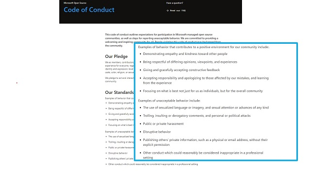

# What is a Code of Conduct?

> A code of conduct is a document that establishes expectations for behavior for your projects participants, this includes those working for an organization and any external collaborators. 

It's also so much more than a document. In that Microsoft's Code of Conduct is based on an open source projected called the Contributor Covenant, which is use by over 40,000 other open source projects including Ruby Rails, Swift, Go and .Net!   It provides examples of both expected behaviors, and those which will not be tolerated.  It is not exhaustive, but it should be fairly clear that what's not acceptable in a professional context is not acceptable in open source collaborations.

**NOTE**: we have avoided terms like 'don't be a jerk, or be nice' to avoid personal interpretation and hidden bias of what those terms might mean to a person, or even culturally.