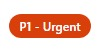

# P1 This report is urgent – drop everything else

**NOTE:** *These are all examples based on the types of incidents which can occur in an open source community, and not based on any specific events or incidents and do not come with prescriptive resolutions. Rather, these are intended to help you practice thinking about the context, capacity and scope of incidents.*

*For cases of this urgency, its important to work with HR, legal, policy and other stakeholders as much as possible while prioritizing the privacy and safety of individuals.*

**Example Scenario 1**:  A well known and liked contributor to your project, after an absence for unknown reasons returns to your project with a noticeably different tone.  They are impatient with maintainers, and being very short in responses to comments on their PRs.  It's challenging for the maintainer to understand the behaviors, and tries to be as patient as possible waiting for this person's usual-self to return.  For reasons that aren't clear this person begins to included personal information in their complaints

> "Didn't you see my comment? Your reasons for not accepting this PR make NO SENSE"

> "You obviously don't care about me, or my mental health"

> "It seems like you just want to get rid of me, which takes away my whole purpose for living"

> "You would probably be happy if I was dead"

Many times, we focus on P1 (urgent, stop everything) type issues as being someone threatening others, but it can happen that you have someone who is experiencing mental illness, or or operating in limited capacity might actually use threat of self-harm as a type of threat. In a situation like this its very hard to know what to do, and based on region local supports for mental health services vary. 

In a situation like this, issuing a warning or ban would be unlikely to stop the behaviors, and perhaps further impact both the community, and this individual. It's important to work with your legal, HR and safety experts to decide on which steps will result in the least likely path for harm  

--- 

**Example Scenario 2**:  A person known to your project posts pornographic material in a chat channel used by many community members, but not an official channel for your project.  Community members reach out to you, or someone on your project to report this as a violation of your CoC.

While it may be tempting to dismiss anything that happens outside of your project as being 'out of your control', the impact on your community is unchanged.  Microsoft's code of conduct includes a line to make clear:

> *(From Microsoft's COde of Conduct) This Code of Conduct also applies to actions taken outside of these spaces, and which have a negative impact on community health*.

As this is a clear P1 violation, and bold attempt to intimidate, humiliate and upset individuals in the community the consequence ladder can be helpful. 

---

**Example Scenario 3**:  Someone at ane community event reaches out to you, that another community member has made racist, sexist comments towards them. 

Events should, and usually do have code of conduct processes, redirect people to services and process for enforcement that are local, and setup to respond quickly and in the location of the violation.  

That said you will need to have some idea of the outcome of that process, and as much as possible work to understand the outcome for decision making in online spaces. For example if this person was banned from the community event, then its likely they should be banned from digital spaces as well.

