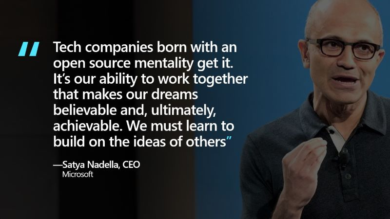

# Introduction - Open Source 

Photo by <a href="https://unsplash.com/@thoughtcatalog?utm_source=unsplash&utm_medium=referral&utm_content=creditCopyText">Thought Catalog</a> on <a href="https://unsplash.com/s/photos/smiling-woman-business?utm_source=unsplash&utm_medium=referral&utm_content=creditCopyText">Unsplash</a>

Simply put, open source software ("OSS"), is that which has the source code freely available for possible modification and redistribution as described in an open source license.  OSS has accelerated the pace of innovation through ecosystem collaboration making software more secure, of higher quality and more accessible to diverse groups of developers and users.

Today, the open source ecosystem continues to evolve with challenges of humanity on topics of ethics, access and economics. **The opportunity of open source at this moment in time has never been greater to supercharge your career, bring value back to our customers and the world**.

# Welcome!
 

This course provides an inspiring overview of the potential of open source to supercharge your career as told through the inspiring stories of open source maintainers.

On average this course takes about one hour to complete, and includes a mapping exercise to help you connect your work, goals and dreams with open source at [COMPANY].

# Learning Goals

**By the end of this course you will be able to:**

* Describe the four pillars of open source: use, contribute, release, grow.
* Distinguish between Open Source and InnerSource.
* Describe basic opportunities and challenges of maintaining an open source project.
* Find inspiration in the video stories of three maintainers leading open source projects.
* Connect with networks of peers, experts and mentors as they apply to your goals.
* Create a ‘Career Map’ connecting personal, career and project goals with open source skills.
* Have talking points for manager discussions.

** This is recommended training for engineers all staff working in community-facing roles.**
