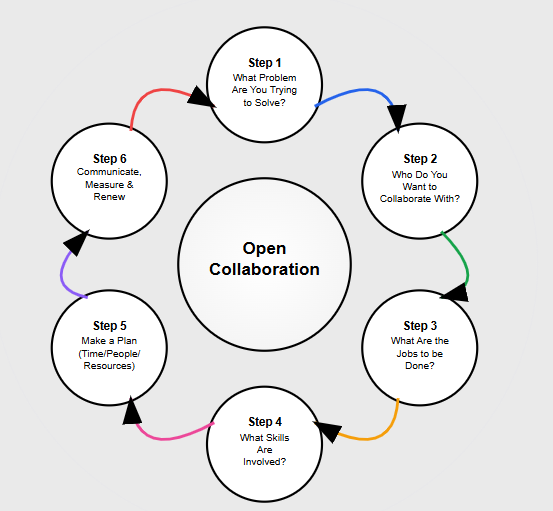

This is a teaching tool for people new to releasing OSS, or who want to revisit their goals for existing projects.  
This does not include guidance for licensing, compliance or other specific legal or business policies

**The latest version includes prompts for AI help**

# Introduction

Open collaboration is an opportunity for innovation beyond what's possible
within a single team or company. It's an opportunity to hear from and work with
customers, to test use-cases, engage with developers extend brand recognition
and gain diverse contributions. This is true for Open: source, science,
education, access, data government and beyond.

# The Open Way

While there is no one way to approach opening your project, there is shared knowledge 
within the ecosystem that you can build on to think and act more strategically.  To ensure that your goals for an OSS project
are strategically aligned with your business goals, based in the reality
of your resources, focused on the jobs needing done, and communicated
effectively. Specifically this is a continual cycle.

This playbook will take you through that release and renewal cycle, to ensure
your success.



Diagram created by Claude.ai based on the steps in this document

## Step 1: What Problem Are you Trying to Solve?

You should never throw a project `over the wall`. By that we mean releasing a
project without explicitly having thought through or committed to the success of
the project beyond the initial release; furthermore thinking of it as an
opportunity to fill gaps, or obtain free labor. Without strategic goals,
projects thrown over the wall become abandoned. That's a terrible experience for
collaborators and looks bad for your organization.

One reason might be a recognition the domain expertise your project needs to grow isn't found in-house.
> Open source is our gateway to be able to collaborate and gather these insights; bridging
> the gap between computer science and industry experts.

Another might be for cross-platform efforts, which require a community collaboration.

### AI Prompt

```
"I'm considering open sourcing a project but I'm not sure if I have the right motivations or if it's worth the effort. Can you help me think through whether this is a good strategic decision? Here's what I'm thinking:
My project/situation: [Describe your project, technology, or initiative]
Why I'm considering open source: [Your initial thoughts - could be anything from "my manager suggested it" to "we need outside expertise"]
Our current challenges: [What problems you're facing - technical limitations, resource constraints, need for broader adoption, etc.]
Our internal capabilities: [What your team is good/not good at, what expertise you're missing]

Can you help me:

- Identify if open sourcing would actually solve a real problem for us
- Clarify what specific outcomes we should be aiming for
- Determine if we have realistic reasons beyond just 'getting free help'
- Spot any red flags that suggest we're not ready for this
- Please ask me clarifying questions to help me think this through strategically rather than just tactically."
```

## Step 2: What is your Collaborative Focus? Where can you find these collaborators?

Whether you have one, or one million people willing to collaborate, success will
only come with being clear about who it is that you need to collaborate with to
solve the problem you've identified. Who are those people: Potential customers? Ecosystem partners? Developers? Localizers?

Working side, by side with customers, for example, can allow a team
team to rapidly experiment and co-build new features independently of the main
product release cycle.

If you build it, there is no guarantee they will come! Think about **where** your
collaborators are, so that you can be strategic in outreach during the planning
phase.

- Universities and colleges
- Start ups
- Industry events
- Diversity-focused tech organizations
- Tech-specific Community Meetups
- Following specific hashtags on social media
- Regionally specific (in countries and speaking languages)

### AI Prompt

```
"I've identified a clear problem that open source could help solve, but now I need to figure out exactly WHO I should be collaborating with. Can you help me think through my collaborative focus strategy?
The problem I'm trying to solve: [Brief summary from Step 1]
My initial thoughts on who might help: [Any ideas you have - developers, users, companies, academics, etc.]
Our project/product context: [What you're building, what industry/domain, current user base if any]
What we're hoping collaboration will achieve: [Specific outcomes - faster development, broader adoption, specialized expertise, testing across platforms, etc.]
Can you help me:

Identify the specific types of people/organizations who would be most valuable collaborators for our goals
Think through what each type of collaborator would want to get out of working with us (what's in it for them?)
Prioritize which collaborator groups to focus on first vs. later
Understand the difference between collaborators who will USE our project vs. those who will CONTRIBUTE to it
Avoid being too broad and unfocused in our outreach

Please ask me questions to help narrow down from 'everyone who might be interested' to 'the specific people we most need to succeed.'
Also, where do you think I'm most likely to find these collaborators?"
```

## Step 3: What are the Jobs to be Done?

Now that you know who you want to collaborate with, it's time to ask - what
needs to happen to make that successful? 

Success is a two-way street.  You will need to entwine your project and organizational needs with the community needs. What are the Job's to be done?

**...by your collaborators**

Think about the types of activities that you need from your collaborators. Some
examples might be:

- Documentation
- Proposing new workflows
- Testing/QA
- Opening issues (bugs, feature requests)
- Developer advocacy (sharing successes and enthusiasm on social media)
- Translation/Localization'
- Community building

Try to pick one or two up front to focus on first. You can always, and are
encouraged to revisit.

**...by your team to enable collaborator success**

Looking at the jobs you need from your collaborators, ask yourself "_What do we
need to do to make collaborators feel successful_?"

- Responsiveness to pull requests
- Creating content for sharing
- Developer scripts
- Mentorship

### AI Prompt

```
"I know who I want to collaborate with, but now I need to figure out the specific 'jobs to be done' - both what I need from collaborators AND what I need to do to make them successful. Can you help me create a realistic collaboration plan?
Who I want to collaborate with: [Summary from Step 2 - your target collaborator types]
My project's current state: [How mature/polished it is, what's working, what needs work]
My team's capacity: [How much time/people we can realistically dedicate to supporting collaborators]
What I think I need help with: [Initial thoughts - could be technical work, feedback, testing, documentation, etc.]
Can you help me:

Identify 1-2 specific 'jobs' I most need collaborators to do (rather than trying to get help with everything at once)
For each job, figure out what my team needs to provide to make collaborators successful at that job
Think through what collaborators would want/need to feel their contributions are valued and impactful
Spot any unrealistic expectations I might have about what volunteers will do
Create a two-way value exchange where both sides benefit

Specific questions:

What are some realistic first jobs to focus on for someone just starting with open source collaboration?
How do I avoid asking for too much while still getting meaningful help?
What are the most common ways teams accidentally frustrate collaborators?
How do I balance my project needs with what collaborators actually want to work on?

Please help me think about this as building relationships, not just getting free work done."
```

## Step 4: What Skills are Needed?

For each job to be done, what skills (minimally), must people have to be
successful? What gaps might exist for someone slightly less qualified?

Technical skills are important, but what makes a community thrive involves
empowerment and care for people.

### AI Prompt

```
"I've identified the key jobs I need collaborators to do, but now I need to think realistically about what skills people need to be successful - and how to support people who don't have all those skills yet. Can you help me create an inclusive skills framework?
The jobs I want collaborators to do: [List from Step 3 - your 1-2 priority collaboration areas]
My assumptions about required skills: [What you think people need to know - technical skills, tools, domain knowledge, etc.]
My team's mentoring capacity: [How much time/ability you have to help people learn]
Can you help me:

Identify the true minimum skills needed for each job (not the 'nice to have' skills)
Figure out what gaps commonly exist for people who want to help but aren't fully qualified yet
Design ways to support people who have some but not all of the needed skills
Think beyond just technical skills to the interpersonal/community skills that matter
Create pathways for people to grow their skills through contributing

Specific questions:

How do I distinguish between 'must have' vs 'can learn on the job' skills?
What are good 'starter tasks' for people who want to help but lack some skills?
How do I create mentoring structures that don't overwhelm my core team?
What community/soft skills are most important for collaborators to have?
How do I make sure I'm not accidentally excluding people who could be great contributors?

Context about our community: [Any info about your target audience - are they experts, beginners, mixed backgrounds, etc.]
Please help me think about building an inclusive community where people can learn and grow, not just finding people who already have perfect skills."
```


## Step 5: Make a Plan (time/people/resources)

Now that you know who/where/what it's time for how!

Minimally, you should allocate time for issue-responsiveness, and to communicate
project updates (via README or Discussions). This will ensure that the
experience of interacting with your project is positive and people will want
come back

Some other things to consider when planning:

- Time zones
- Languages
- Skills
- Vacation time

- Moderating a GitHub repository
  [Check out the Moderation Pocket Guide](../moderating-oss-repos.md)

If during this step you realize, you do not have enough time. Go back and set
more realistic goals. You can always change them in future.

### AI Prompt

```

"I know who I want to collaborate with and what jobs need doing, but now I need to create a realistic plan for how my team will actually support this collaboration. Can you help me figure out the time, people, and resources needed?
What I want collaborators to do: [Summary from Steps 3-4]
My current team: [How many people, their roles, current workload]
Time I think I can dedicate: [Initial estimate - hours per week, which team members, etc.]
Our constraints: [Time zones we operate in, languages we speak, vacation schedules, other commitments]
Can you help me:

Figure out the minimum time commitment needed to make collaboration actually work (not just launch and abandon)
Create a realistic weekly/monthly plan for essential activities like responding to issues and communicating updates
Identify what happens if I'm unavailable (vacation, sick, busy with other work)
Plan for moderation and community management beyond just technical responses
Build in buffer time because collaboration always takes longer than expected

Specific questions:

What are the non-negotiable time commitments for successful open source collaboration?
How do I handle collaborators in different time zones without burning out my team?
What should I do if I realize during this planning that I don't have enough time?
How do I set boundaries about what my team can and can't support?
What early warning signs suggest I'm taking on too much?

Red flag check: If my plan requires more time than my team realistically has, please tell me to go back and scale down my goals from earlier steps.
Please help me create a sustainable plan that sets up both my team and collaborators for success, not burnout."
```

## Step 6: Communicate in all Directions

Communication is everything. This is true for your collaborators, for your
manager, and their manager and your peers.

> "Every time there's a lack of communication, people fill in the gaps. They
> tend to fill them in with whatever fear, uncertainty, or doubt they have in
> their heads" - OSS Maintainer


**Contributors**

- Ensure your README.md is always up to date. Make sure you are as clear about
  what type of collaboration and contribution you are not able to support in the
  moment, as those you are. This helps people avoid investing time in the wrong
  place
- Communicate any planned, or unplanned absences of maintainers to manage
  expectations.
- Setup a bot, or empower a community member to welcome every new contributor -
  this can be via a separate chat channel or right in issues and GitHub
  Discussions.

**Managers and Leadership**

- Regularly, report the impact of external contributions on business goals. If
  you're feeling challenged to do that, have a conversation with your manager to
  align. Don't wait for those conversations.
- Be honest about the time you are investing, and set goals for that as well.
  Burnout helps no one.

**Cross-Organizationally**

- Keep internal collaboration a focus as well, share your goals and bring others
  in who might have similar. It's always possible to get more resources and
  internal contributions this way!

**Externally**

- Write, blog, share even when its early days.

### AI Prompt
```
"I have a plan for open source collaboration, but now I need to think about communication strategy - not just with contributors, but with my manager, leadership, and peers. Can you help me create a comprehensive communication plan that prevents misunderstandings and builds support?
My collaboration plan so far: [Brief summary of who, what, how from previous steps]
My organizational context: [Your role, who you report to, team structure, company culture around open source]
Current communication gaps: [Any existing confusion, lack of updates, or misaligned expectations you're aware of]
Can you help me create communication strategies for:
1. External Collaborators:

How to keep contributors informed about project direction and changes
Ways to acknowledge contributions and make people feel valued
Setting clear expectations about response times and processes

2. My Manager/Leadership:

How to regularly report on collaboration impact and business value
What metrics to track and share to demonstrate success
How to ask for support or resources when needed

3. Internal Peers/Teams:

Keeping other teams informed about external contributions affecting them
Building internal support and preventing territorial concerns
Sharing learnings and encouraging broader open source adoption

Specific questions:

What are the most common communication failures that kill open source projects?
How do I prevent people from 'filling in gaps with fear and uncertainty'?
What should I communicate proactively vs. only when asked?
How often should I be updating different audiences?
What's the best way to celebrate wins and handle setbacks transparently?

Please help me think about communication as an ongoing strategic activity, not just occasional updates when I remember."
```

## Step 6: Measure

Some of the tools below can provide you with tooling for metrics insights.

- [CHAOSS Tool](https://ai.chaoss.io/): This is a community tool which provides
  some of the most popular metrics for a given GitHub repository. They're also
  open to new requests, and improvements via the
- [CHAOSS community](https://chaoss.community/).

What does success look like for each of the jobs to be done, for you and your
collaborators? Look back at the jobs to be done for your team and your
collaborators? Pick one metric for each, and check in each week. Some
considerations:

### For your collaborators

- New contributors
- Number of new issues and/or pull requests in the specific area you need help
  (i.e. documentation prs)

### For your team

- Time to first response
- Contributor onboarding progress (qualitative)
- OpenSSF Scorecard results (GitHub repos scores available in the
  [Open Source Portal](https://aka.ms/opensource/repos))

## Step 7: Repeat and Renew


**Releasing a project openly is just a beginning, it's something that needs
regularly revisited. It's a renewable cycle**:

- Is the problem you're solving still the same?
- Are you still focusing on the right collaborators, jobs, skills and metrics?​

At times it may be true that your project is no longer an investment you want to
continue, and that's OK too.  We'll include a documentation on sunsetting and/or transfiering an OSS project in future.

### AI Prompt

```
"I've been running an open source project for [time period] and I want to step back and reflect on whether my original strategy is still working. Can you help me think through this renewal process honestly and strategically?
My original open source strategy:

Problem I was trying to solve: [What you started with]
Who I wanted to collaborate with: [Original target collaborators]
Jobs I needed done: [What you originally needed help with]
What's happened since then: [Brief summary of what actually occurred]

Current reality check:

What's working well: [Successes, positive outcomes]
What's not working: [Challenges, unmet expectations, energy drains]
What's changed: [In your project, organization, market, or personal priorities]

Can you help me reflect on:

Is the original problem I was solving still relevant and important?
Are the collaborators I'm working with the right ones for where the project is now?
Have the jobs that need doing evolved, and am I asking for the right help?
Are my success metrics still meaningful, or do I need different measures?
Is my team's investment of time and energy still justified by the outcomes?

Honest questions I'm wrestling with:

Am I continuing this because it's still strategic, or just because I started it?
What would I do differently if I were starting fresh today?
Is it okay to significantly change direction, or even wind down this effort?

Please help me think through this as a strategic review, not a failure assessment. I want to make intentional choices about what comes next, whether that's doubling down, pivoting, or gracefully concluding this phase."
```
