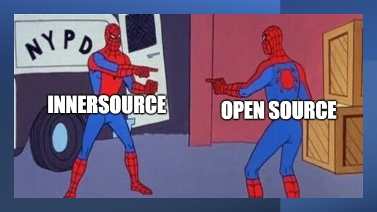

# InnerSource or Open Source?

While this course does not specifically cover InnerSource, it's important to understand both the similarities and differences. Both require collaboration, both usually involve some mechanism for sharing code and building on the work of others, as well as tooling to track issues and respond to pull requests.  

The main difference is WHO you collaborate with, which tools, and how that software is license.

InnerSource is the collaboration between teams **inside an organization** on projects and products that are not publicly available.  At [company] we use OnBranch for InnerSource collaboration.

Open Source is a collaboration with those **external to the organization** on software that licensed open source. At [company] we use GitHub.com for Open Source collaboration.  
Note,  that just putting code on GitHub does not make it open source, it's the [open source license](https://docs.github.com/en/repositories/managing-your-repositorys-settings-and-features/customizing-your-repository/licensing-a-repository) that does that.